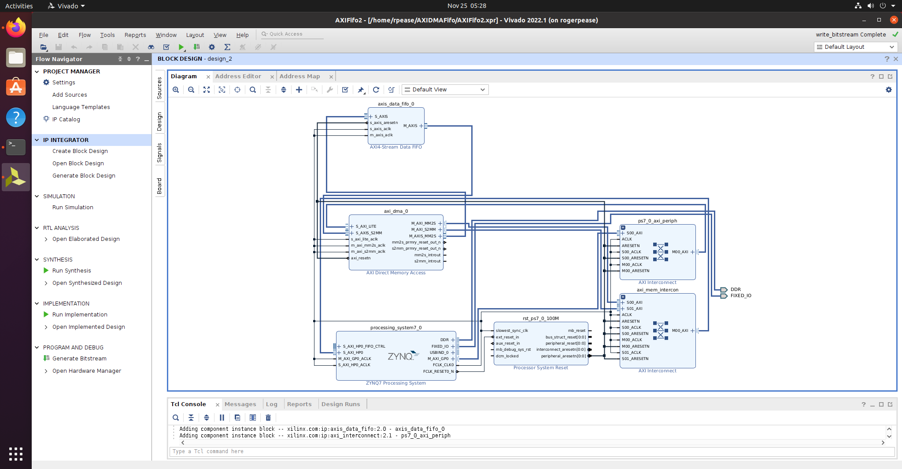

# AXIDMAFifo

Simple FIFO->DMA Combination. Data gets written in one channel and out the other. 

 

# Notes

-- Make sure to add an HP Memory interface to ZYNQ. The data needs to get in/out of dma but also in/out of system memory.
-- Turn off scatter-gather on DMA (it's for pulling data from discontinuous memory such as pages). 
-- If your DMA channel shows as non-halted, you probably forgot the DMA-to-SYSTEM memory bus. 

